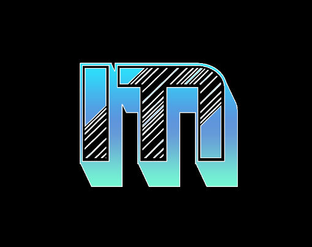

 

  

<h3 align="center">project_title</h3>

<!-- TABLE OF CONTENTS -->

  
Table of Contents

  <ol>
    <li>
      <ul>
        <li><a href="#prerequisites">Prerequisites</a></li>
        <li><a href="#installation">Installation</a></li>
      </ul>
    </li>
    <li><a href="#usage">Usage</a></li>
    <li><a href="#acknowledgments">Acknowledgments</a></li>
  </ol>

<!-- ABOUT THE PROJECT -->
## About The Project

This bot is **not** made for raiding discords ;)

(<a href="#readme-top">back to top</a>)

### Prerequisites

* [Latest Verison of Python](https://www.python.org/downloads/)
* [Discord Bot Token](https://www.youtube.com/watch?v=zrNloK9b1ro)

### Installation

1. Download SC
2. Open start.bat
3. Click setup --> tokens --> add token (If you have multiple click upload)

(<a href="#readme-top">back to top</a>)

<!-- USAGE EXAMPLES -->
## Usage

Use this bot at your own risk, the developers are not responsible for your actions. This bot was made for educational purposes.

(<a href="#readme-top">back to top</a>)

<!-- LICENSE -->
## License

Distributed under the MIT License. See `LICENSE` for more information.

(<a href="#readme-top">back to top</a>)

<!-- ACKNOWLEDGMENTS -->
## Acknowledgments

* [TheMiddleErmine](https://discord.gg/77VjjBTasa)

(<a href="#readme-top">back to top</a>)

